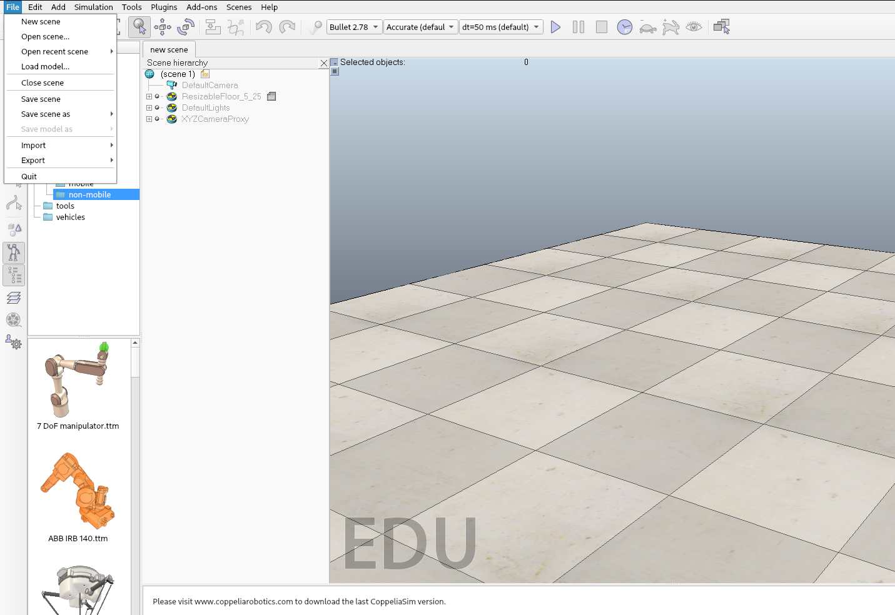

# Need4stek
###### Partners: **Raquel Costumero Fernández** & **Sofía Martín Pajares**

## Objectives:
Create our own **autonomous car**.

<u>Tools provided:</u>
* **CoppeliaSim:** for the creation and control of robots. (for this project we have virtuals tracks & a car)
* **API:** the communication interface with a bunch of commands
* **shell script:** enables the connection between our program & the API

## Usage:
First of all, open CoppeliaSim with the following command:
```
./CoppeliaSim_Edu_Ubuntu/coppeliaSim
```
Open a scene in the from the scenes folder 


In order to start the program, make sure to compile:
```
make re
```
Then execute the following command:
```
./pipe.sh
```
